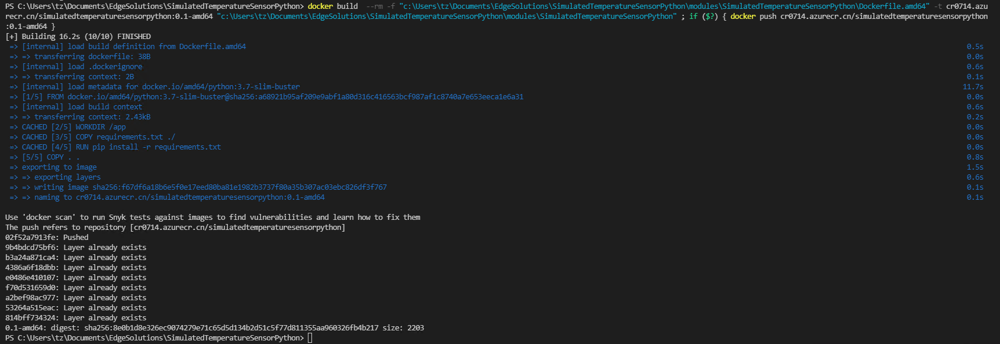
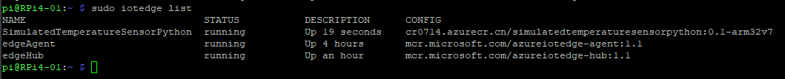
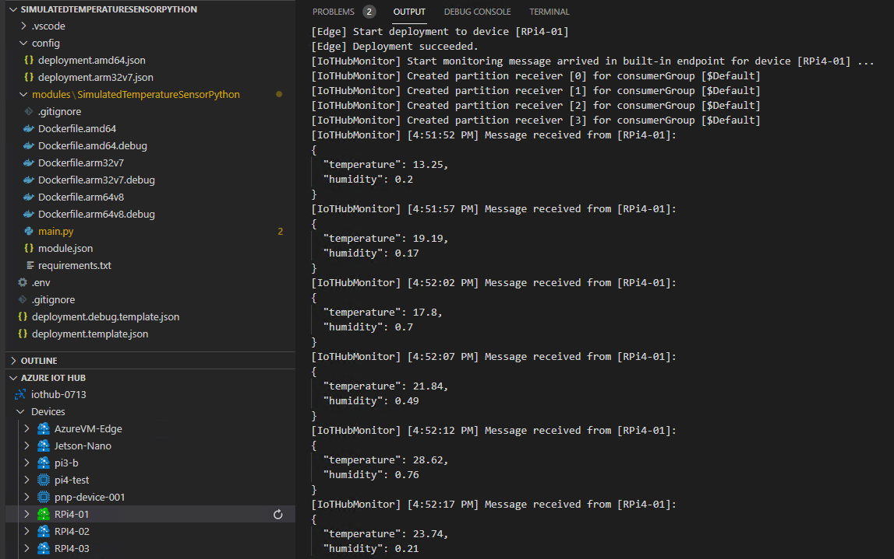

# Simulated Temperature Sensor using Python SDK

## Prerequisites

### Developing environment
- Dev PC, Win10 Pro 19043+
- Docker Desktop with WSL 2 base engine
- Python 3.7+
- VS Code with extension:
  - Azure Account
  - Python
  - Azure IoT Tools

### Target device
- Raspberry Pi 4B

### Azure Global

- IoT Edge Connection String: `HostName=iothub-0707.azure-devices.net;DeviceId=RPi4-01;SharedAccessKey=INh****************************nxo=`

- Container Registry:
  - Registry name: `cr0713`
  - Login server: `cr0713.azurecr.io`
  - Password: `g4n******************dKw`
### Azure China

- IoT Edge Connection String: `HostName=iothub-0713.azure-devices.cn;DeviceId=RPi4-01;SharedAccessKey=Lr1***************************HI4=`

- Container Registry:
  - Registry name: `cr0714`
  - Login server: `cr0714.azurecr.cn`
  - Password: `25M******************gwl`
- 
## Step 1: Create a new IoT Edge Solution in VS Code


### 1. Azure Login

In VS Code, press `Ctrl+Shift+P` to open the command palette -> Select `Azure: log in` -> Follow the instructions to sign in Azure global or Auzre China account.

### 2. Create a new edge solution

In the command palette, run `Azure IoT Edge: New IoT Edge solution` -> Select folder -> Provide a solution name: `Simulated-Temperature-Sensor-python` -> Select module template: `Python Module` -> Provide a module name: `Simulated-Temperature-Sensor-python` -> Provide Docker image repository: `cr0713.azurecr.io/`.

### 3. Add container registry credentials

In VS Code, open `.env` and ensure the registery username and password are there:
  
  ```
  CONTAINER_REGISTRY_USERNAME_cr0713=cr0713
  CONTAINER_REGISTRY_PASSWORD_cr0713=g4n**************dKw
  ```

### 4. Select target architecture

Since we are using RPI4, the target architecture shall be `arm32v7`.

You may open command palette and search `Azure IoT Edge: Set Default Target Plaform for Edge` -> Select `arm32v7`.

You may also click the `amd64` icon from the status bar to make this change.


## Step 2: Write some codes to simulate telemetry

In VS Code, open `main.py` -> press `Ctrl+A` and `Delete`.

You may need some basic knowledge of how to send a message to Azure IoT Hub using Azure IoT Device Python SDK. 


### 1. Import IoTHubModuleClient

```
from azure.iot.device.aio import IoTHubModuleClient
```

### 2. Use module_client methods

```
# Create client object to interact with Azure IoT Hub
module_client = IoTHubModuleClient.create_from_connection_string(EdgeHubConnectionString)
```

Below methods are similar to the device_client methods.
- connect()
- send_message()
- shutdown()


If you want to find more info re IoTHubModuleClient module, you may refer to [this](https://docs.microsoft.com/en-us/python/api/azure-iot-device/azure.iot.device.iothubmoduleclient?view=azure-python).

### 3. Connect the client.

Just use below code:
```
# Connect the client
await module_client.connect()
```  

### 4. Simulate the telemetry

In this sample, I used the random.uniform() method to simulate the temperature between 10 degrees to 35 degrees, and the humidity between 10% to 80%. 

### 5. Send the message to IoT Hub

Here I used module_client.send_message() method.

### 6. Finally, disconnect or shutdown.

The final code can be found from [here](sources/main.py).

## Step 3. Modify deployment template

In VS Code, click `deployment.template.json`, and make below modifications:
- Remove the `SimulatedTemperatureSensor` part
- Modify `Simulated_Temperature_Sensor_python` -> `settings` -> `createOptions`:
  - "createOptions": `"{\"HostConfig\":{\"Privileged\": true}}"`
- Remove 2nd line in `$edgeHub -> routes`. 

## Step 4: Docker build and push

Right-click on `deployment.template.json` -> Select `Build and push to IoT Edge Solution`. You will see below logs.



Here you may build for multiple platforms: AMD64, arm32v7, arm64v8.

## Step 5: Deploy to a single device

Once docker build is completed, you will see a deployment manifest created under folder `./config.` 

Right click on `deployment.arm32v7.json` and select `Create Deployment for a Single Device` -> Select the target device: `RPi4-01`.


## Step 6: View the result

Go to your RPi4, list the edge.
```
sudo iotedge list
```



In VS code, check the logs of your target edge device.



<END>